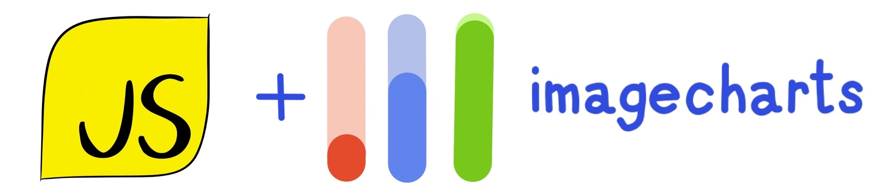

[](#getting-started)

[](https://www.npmjs.org/package/image-charts)


<!--
[](http://npm-stat.com/charts.html?package=image-charts)


-->

Official [Image Charts](https://image-charts.com/) API client.
Generate URLs of static image charts.
Embed them everywhere in emails, pdf reports, chat bots...!

### Getting started

#### 1. Install Image-Charts [npm](https://www.npmjs.com/package/image-charts) Package

```bash
npm install image-charts --save
```

#### 2. Import Image-Charts library

> CommonJS

```javascript
const ImageCharts = require('image-charts');
```

> ES6

```javascript
import ImageCharts from 'image-charts';
```

#### 3. Generate a chart image

```js
const pie = ImageCharts().cht('p').chd('a:2.5,5,8.3').chs('100x100');

pie.toURL(); // String: https://image-charts.com/chart?chd=a%3A2.5%2C5%2C8.3&chs=600x300&cht=p
pie.toFile('/path/to/chart.png'); // Promise<()>
pie.toDataURI(); // Promise<String> : data:image/png;base64,iVBORw0KGgo...
pie.toBuffer(); // Promise<Buffer> : Buffer 89 50 4e 47 0d 0a 1a 0a 00 00 00 ...
```

<p align="center">
    <a href="https://www.image-charts.com/">
        
    </a>
</p>

-----------------------------------------------------------------------

### Table of Contents

- __[Enterprise support](#enterprise-support)__
- __[On-Premise support](#on-premise-support)__
- __[Constructor](#constructor)__
    - __[Options](#options)__
- __[Methods](#methods)__
    - __[toURL()](#tourl)__
    - __[toFile()](#tofile)__
    - __[toBuffer()](#tobuffer)__
    - __[toDataURI()](#todatauri)__
   - __[cht(value) - Chart type](#cht)__
   - __[chd(value) - chart data](#chd)__
   - __[chds(value) - data format with custom scaling](#chds)__
   - __[choe(value) - QRCode data encoding](#choe)__
   - __[chld(value) - QRCode error correction level and optional margin](#chld)__
   - __[chxr(value) - Axis data-range](#chxr)__
   - __[chof(value) - Image output format](#chof)__
   - __[chs(value) - Chart size (&lt;width&gt;x&lt;height&gt;)](#chs)__
   - __[chdl(value) - Text for each series, to display in the legend](#chdl)__
   - __[chdls(value) - Chart legend text and style](#chdls)__
   - __[chg(value) - Solid or dotted grid lines](#chg)__
   - __[chco(value) - series colors](#chco)__
   - __[chtt(value) - chart title](#chtt)__
   - __[chts(value) - chart title colors and font size](#chts)__
   - __[chxt(value) - Display values on your axis lines or change which axes are shown](#chxt)__
   - __[chxl(value) - Custom string axis labels on any axis](#chxl)__
   - __[chxs(value) - Font size, color for axis labels, both custom labels and default label values](#chxs)__
   - __[chm(value) - compound charts and line fills](#chm)__
   - __[chls(value) - line thickness and solid/dashed style](#chls)__
   - __[chl(value) - bar, pie slice, doughnut slice and polar slice chart labels](#chl)__
   - __[chlps(value) - Position and style of labels on data](#chlps)__
   - __[chma(value) - chart margins](#chma)__
   - __[chdlp(value) - Position of the legend and order of the legend entries](#chdlp)__
   - __[chf(value) - Background Fills](#chf)__
   - __[chbr(value) - Bar corner radius. Display bars with rounded corner.](#chbr)__
   - __[chan(value) - gif configuration](#chan)__
   - __[chli(value) - doughnut chart inside label](#chli)__
   - __[icac(value) - image-charts enterprise `account_id`](#icac)__
   - __[ichm(value) - HMAC-SHA256 signature required to activate paid features](#ichm)__
   - __[icff(value) - Default font family for all text from Google Fonts. Use same syntax as Google Font CSS API](#icff)__
   - __[icfs(value) - Default font style for all text](#icfs)__
   - __[iclocale(value) - localization (ISO 639-1)](#iclocale)__
   - __[icretina(value) - retina mode](#icretina)__
   - __[icqrb(value) - Background color for QR Codes](#icqrb)__
   - __[icqrf(value) - Foreground color for QR Codes](#icqrf)__

----------------------------------------------------------------------------------------------

### Constructor

> Create an instance, the argument within [ ] is optional. See [usage](#usage)

```javascript
ImageCharts( [ Object opt ] )
// or
new ImageCharts( [ Object opt ] )
```

#### Options

> Default options are listed below.

```javascript
opt = {
    /*
     * Request timeout (in millisecond) when calling toBuffer() or toDataURI()
     */
    timeout: 5000,

    /*
     * (Enterprise and Enterprise+ subscription only) SECRET_KEY
     */
    secret: null,

    /*
     * (Enterprise, Enterprise+ and On-Premise subscription only) custom domain
     */
    host: 'image-charts.com',

    /*
     * (On-Premise subscription only) custom protocol
     */
    protocol: 'https',

    /*
     * (On-Premise subscription only) custom port
     */
    port: 443,

    /*
     * (On-Premise subscription only) custom pathname
     */
    pathname: '/chart'
}
```

- _[Back to Getting started](#getting-started)_
- _[Back to ToC](#table-of-contents)_

----------------------------------------------------------------------------------------------

### Methods

----------------------------------------------------------------------------------------------

<a name="tourl"></a>
#### `toURL()` : `String`

> Get the full Image-Charts API url (signed and encoded if necessary)

##### Usage

```javascript
import ImageCharts from 'image-charts';

const chart_url = ImageCharts()
.cht('bvg') // vertical bar chart
.chs('300x300') // 300px x 300px
.chd('a:60,40') // 2 data points: 60 and 40
.toURL(); // get the generated URL

console.log(chart_url); // https://image-charts.com/chart?cht=bvg&chs=300x300&chd=a%3A60%2C40

```

- _[Back to Getting started](#getting-started)_
- _[Back to ToC](#table-of-contents)_


----------------------------------------------------------------------------------------------

<a name="toFile"></a>
#### `toFile(file)` : `Promise<()>`

> Creates a file containing generated chart image and yield a promise.

> When `file` is a filename, asynchronously writes data to the file, replacing the file if it already exists.
> When `file` is a file descriptor, the behavior is similar to calling fs.write() directly (which is recommended).

##### Usage

```javascript
import ImageCharts from 'image-charts';

const chart_path = '/tmp/chart.png';

ImageCharts()
.cht('bvg') // vertical bar chart
.chs('300x300') // 300px x 300px
.chd('a:60,40') // 2 data points: 60 and 40
.toFile(chart_path)
.then(() => console.log('Image chart written at %s', chart_path))

```

- _[Back to Getting started](#getting-started)_
- _[Back to ToC](#table-of-contents)_

----------------------------------------------------------------------------------------------

<a name="tobuffer"></a>
#### `toBuffer()` : [Promise](https://developer.mozilla.org/en-US/docs/Web/JavaScript/Reference/Global_Objects/Promise)<[`Buffer`](https://nodejs.org/api/buffer.html)>

> Do a request to Image-Charts API with current configuration and yield a promise of a NodeJS buffer

##### Usage

```javascript
import ImageCharts from 'image-charts';

const chart_url = ImageCharts()
.cht('bvg') // vertical bar chart
.chs('300x300') // 300px x 300px
.chd('a:60,40') // 2 data points: 60 and 40
.toBuffer(); // download chart image as a buffer

console.log(chart_url); // <Buffer 89 50 4e 47 0d 0a 1a 0a 00 00 00 ...

```

- _[Back to Getting started](#getting-started)_
- _[Back to ToC](#table-of-contents)_

----------------------------------------------------------------------------------------------

<a name="todatauri"></a>
#### `toDataURI()` : `String`

> Do a request to Image-Charts API with current configuration and yield a promise of a base64 encoded [data URI](https://developer.mozilla.org/en-US/docs/Web/HTTP/Basics_of_HTTP/Data_URIs)

##### Usage

```javascript
import ImageCharts from 'image-charts';

const chart_url = ImageCharts()
.cht('bvg') // vertical bar chart
.chs('300x300') // 300px x 300px
.chd('a:60,40') // 2 data points: 60 and 40
.toDataURI(); // download chart image and generate a data URI string

console.log(chart_url); // "data:image/png;base64,iVBORw0KGgo...

```

- _[Back to Getting started](#getting-started)_
- _[Back to ToC](#table-of-contents)_

----------------------------------------------------------------------------------------------

#### Enterprise Support

Image-Charts Enterprise and Enterprise+ subscriptions remove the watermark and enable advanced features like custom-domain, high-resolution charts, custom fonts, multiple axis and mixed charts.

- [Pricing and plan comparison](https://www.image-charts.com/pricing)
- [Enterprise documentation](https://documentation.image-charts.com/enterprise/)

##### Usage

Once subscribed to a plan you will receive an `ACCOUNT_ID` and a `SECRET_KEY`.
These two parameters are mandatory to sign your request and remove the watermark.
Replace both values in the code example below:

```javascript
import ImageCharts from 'image-charts';

const chart_url = ImageCharts({secret: 'SECRET_KEY'})
.icac('ACCOUNT_ID')
.cht('p3') // pie chart
.chs('700x190') // 700px x 190px
.chd('t:60,40') // 2 data points: 60 and 40
.chl('Hello|World') // 1 label per pie slice : "Hello" and "World"
.chf('ps0-0,lg,45,ffeb3b,0.2,f44336,1|ps0-1,lg,45,8bc34a,0.2,009688,1') // 1 gradient per pie slice
.icretina('1') // enable paid-only features like high-resolution charts
.toURL(); // get the whole (HMAC signed) URL

console.log(chart_url);
// https://image-charts.com/chart?chd=t%3A60%2C40&chf=ps0-0%2Clg%2C45%2Cffeb3b%2C0.2%2Cf44336%2C1%7Cps0-1%2Clg%2C45%2C8bc34a%2C0.2%2C009688%2C1&chl=Hello%7CWorld&chs=700x190&cht=p3&icac=documentation&icretina=1&ichm=122242bb700d825d69b3fafe4ec67193b45dcfe0ed93fcca307e0d0a84b73ea2

```

<p align="center"></p>

- _[Back to Getting started](#getting-started)_
- _[Back to ToC](#table-of-contents)_

----------------------------------------------------------------------------------------------

#### On-Premise Support

Image-Charts virtual appliance can be deployed anywhere inside a customer network.


```javascript
import ImageCharts from 'image-charts';

const chart_url = ImageCharts({
        secret: 'SECRET_KEY',

        // override the host with your own endpoint
        host: 'custom-domain.tld'
    })
    .icac('ACCOUNT_ID')
    .cht('p3') // pie chart
    .chs('700x190') // 700px x 190px
    .chd('t:60,40') // 2 data points: 60 and 40
    .chl('Hello|World') // 1 label per pie slice : "Hello" and "World"
    .chf('ps0-0,lg,45,ffeb3b,0.2,f44336,1|ps0-1,lg,45,8bc34a,0.2,009688,1') // 1 gradient per pie slice
    .icretina('1') // enable paid-only features like high-resolution charts
    .toURL(); // get the whole (HMAC signed) URL

console.log(chart_url);
// https://custom-domain.tld/chart?chd=t%3A60%2C40&chf=ps0-0%2Clg%2C45%2Cffeb3b%2C0.2%2Cf44336%2C1%7Cps0-1%2Clg%2C45%2C8bc34a%2C0.2%2C009688%2C1&chl=Hello%7CWorld&chs=700x190&cht=p3&icac=documentation&icretina=1&ichm=122242bb700d825d69b3fafe4ec67193b45dcfe0ed93fcca307e0d0a84b73ea2
```

- _[Back to Getting started](#getting-started)_
- _[Back to ToC](#table-of-contents)_


----------------------------------------------------------------------------------------------

<a name="cht"></a>
#### `cht( value )` : [`ImageCharts`](#constructor)

> Chart type

> [Reference](https://documentation.image-charts.com/reference/chart-type/)


##### Allowed values: 
<a href="https://editor.image-charts.com/#https:/image-charts.com/chart?chd=a%3A30010%2C-30000%2C50000%2C80000%2C20000&chdl=Income&chf=b0%2Clg%2C90%2CEA469EFF%2C1%2C03A9F47C%2C0.4&chl=2014%7C2015%7C2016%7C2017%7C2018&chs=700x300&cht=bvs&chxt=y" target="_blank"><pre>.cht("bvs")</pre></a>
<a href="https://editor.image-charts.com/#https:/image-charts.com/chart?chd=a%3A30010%2C-30000%2C50000%2C80000%2C20000&chdl=Income&chf=b0%2Clg%2C90%2CEA469EFF%2C1%2C03A9F47C%2C0.4&chl=2014%7C2015%7C2016%7C2017%7C2018&chs=700x300&cht=bvg&chxt=y" target="_blank"><pre>.cht("bvg")</pre></a>
<a href="https://editor.image-charts.com/#https:/image-charts.com/chart?chd=a%3A30010%2C-30000%2C50000%2C80000%2C20000&chdl=Income&chf=b0%2Clg%2C90%2CEA469EFF%2C1%2C03A9F47C%2C0.4&chl=2014%7C2015%7C2016%7C2017%7C2018&chs=700x300&cht=bhs&chxt=y" target="_blank"><pre>.cht("bhs")</pre></a>
<a href="https://editor.image-charts.com/#https:/image-charts.com/chart?chd=a%3A30010%2C-30000%2C50000%2C80000%2C20000&chdl=Income&chf=b0%2Clg%2C90%2CEA469EFF%2C1%2C03A9F47C%2C0.4&chl=2014%7C2015%7C2016%7C2017%7C2018&chs=700x300&cht=bhg&chxt=y" target="_blank"><pre>.cht("bhg")</pre></a>
<a href="https://editor.image-charts.com/#https:/image-charts.com/chart?chd=a%3A30010%2C-30000%2C50000%2C80000%2C20000&chdl=Income&chf=b0%2Clg%2C90%2CEA469EFF%2C1%2C03A9F47C%2C0.4&chl=2014%7C2015%7C2016%7C2017%7C2018&chs=700x300&cht=bvo&chxt=y" target="_blank"><pre>.cht("bvo")</pre></a>

Other allowed values are: <pre>p | p3 | pc | pd | ls | lc | lxy | ls:nda | lc:nda | lxy:nda | pa | bb | gv | gv:dot | gv:neato | gv:circo | gv:fdp | gv:osage | gv:twopi | qr | r</pre>


- _[Back to Getting started](#getting-started)_
- _[Back to ToC](#table-of-contents)_


----------------------------------------------------------------------------------------------

<a name="chd"></a>
#### `chd( value )` : [`ImageCharts`](#constructor)

> chart data

> [Reference](https://documentation.image-charts.com/reference/data-format/)


##### Usage


<a href="https://editor.image-charts.com/#https:/image-charts.com/chart?chd=a%3A-100%2C200.5%2C75.55%2C110&chdl=Income&chf=b0%2Clg%2C90%2CEA469EFF%2C1%2C03A9F47C%2C0.4&chl=2014%7C2015%7C2016%7C2017%7C2018&chs=700x300&cht=bvs&chxt=y" target="_blank"><pre>.chd("a:-100,200.5,75.55,110")</pre></a>
<a href="https://editor.image-charts.com/#https:/image-charts.com/chart?chd=t%3A10%2C20%2C30%7C15%2C25%2C35&chdl=Income&chf=b0%2Clg%2C90%2CEA469EFF%2C1%2C03A9F47C%2C0.4&chl=2014%7C2015%7C2016%7C2017%7C2018&chs=700x300&cht=bvs&chxt=y" target="_blank"><pre>.chd("t:10,20,30|15,25,35")</pre></a>
<a href="https://editor.image-charts.com/#https:/image-charts.com/chart?chd=s%3ABTb19_%2CMn5tzb&chdl=Income&chf=b0%2Clg%2C90%2CEA469EFF%2C1%2C03A9F47C%2C0.4&chl=2014%7C2015%7C2016%7C2017%7C2018&chs=700x300&cht=bvs&chxt=y" target="_blank"><pre>.chd("s:BTb19_,Mn5tzb")</pre></a>
<a href="https://editor.image-charts.com/#https:/image-charts.com/chart?chd=e%3ABaPoqM2s%2C-A__RMD6&chdl=Income&chf=b0%2Clg%2C90%2CEA469EFF%2C1%2C03A9F47C%2C0.4&chl=2014%7C2015%7C2016%7C2017%7C2018&chs=700x300&cht=bvs&chxt=y" target="_blank"><pre>.chd("e:BaPoqM2s,-A__RMD6")</pre></a>

- _[Back to Getting started](#getting-started)_
- _[Back to ToC](#table-of-contents)_


----------------------------------------------------------------------------------------------

<a name="chds"></a>
#### `chds( value )` : [`ImageCharts`](#constructor)

> data format with custom scaling

> [Reference](https://documentation.image-charts.com/reference/data-format/#text-format-with-custom-scaling)


##### Usage


<a href="https://editor.image-charts.com/#https:/image-charts.com/chart?chd=a%3A30010%2C-30000%2C50000%2C80000%2C20000&chdl=Income&chf=b0%2Clg%2C90%2CEA469EFF%2C1%2C03A9F47C%2C0.4&chl=2014%7C2015%7C2016%7C2017%7C2018&chs=700x300&cht=bvs&chxt=y&chds=-80%2C140" target="_blank"><pre>.chds("-80,140")</pre></a>

- _[Back to Getting started](#getting-started)_
- _[Back to ToC](#table-of-contents)_


----------------------------------------------------------------------------------------------

<a name="choe"></a>
#### `choe( value )` : [`ImageCharts`](#constructor)

> QRCode data encoding

> [Reference](https://documentation.image-charts.com/qr-codes/#data-encoding)


##### Allowed values: 
<a href="https://editor.image-charts.com/#https:/image-charts.com/chart?chd=a%3A30010%2C-30000%2C50000%2C80000%2C20000&chdl=Income&chf=b0%2Clg%2C90%2CEA469EFF%2C1%2C03A9F47C%2C0.4&chl=2014%7C2015%7C2016%7C2017%7C2018&chs=700x300&cht=bvs&chxt=y&choe=UTF-8" target="_blank"><pre>.choe("UTF-8")</pre></a>


- _[Back to Getting started](#getting-started)_
- _[Back to ToC](#table-of-contents)_


----------------------------------------------------------------------------------------------

<a name="chld"></a>
#### `chld( value )` : [`ImageCharts`](#constructor)

> QRCode error correction level and optional margin

> [Reference](https://documentation.image-charts.com/qr-codes/#error-correction-level-and-margin)


##### Usage


<a href="https://editor.image-charts.com/#https:/image-charts.com/chart?chd=a%3A30010%2C-30000%2C50000%2C80000%2C20000&chdl=Income&chf=b0%2Clg%2C90%2CEA469EFF%2C1%2C03A9F47C%2C0.4&chl=2014%7C2015%7C2016%7C2017%7C2018&chs=700x300&cht=bvs&chxt=y&chld=L%7C4" target="_blank"><pre>.chld("L|4")</pre></a>
<a href="https://editor.image-charts.com/#https:/image-charts.com/chart?chd=a%3A30010%2C-30000%2C50000%2C80000%2C20000&chdl=Income&chf=b0%2Clg%2C90%2CEA469EFF%2C1%2C03A9F47C%2C0.4&chl=2014%7C2015%7C2016%7C2017%7C2018&chs=700x300&cht=bvs&chxt=y&chld=M%7C10" target="_blank"><pre>.chld("M|10")</pre></a>
<a href="https://editor.image-charts.com/#https:/image-charts.com/chart?chd=a%3A30010%2C-30000%2C50000%2C80000%2C20000&chdl=Income&chf=b0%2Clg%2C90%2CEA469EFF%2C1%2C03A9F47C%2C0.4&chl=2014%7C2015%7C2016%7C2017%7C2018&chs=700x300&cht=bvs&chxt=y&chld=Q%7C5" target="_blank"><pre>.chld("Q|5")</pre></a>
<a href="https://editor.image-charts.com/#https:/image-charts.com/chart?chd=a%3A30010%2C-30000%2C50000%2C80000%2C20000&chdl=Income&chf=b0%2Clg%2C90%2CEA469EFF%2C1%2C03A9F47C%2C0.4&chl=2014%7C2015%7C2016%7C2017%7C2018&chs=700x300&cht=bvs&chxt=y&chld=H%7C18" target="_blank"><pre>.chld("H|18")</pre></a>

- _[Back to Getting started](#getting-started)_
- _[Back to ToC](#table-of-contents)_


----------------------------------------------------------------------------------------------

<a name="chxr"></a>
#### `chxr( value )` : [`ImageCharts`](#constructor)

> Axis data-range

> [Reference](https://documentation.image-charts.com/reference/chart-axis/#axis-range)


##### Usage


<a href="https://editor.image-charts.com/#https:/image-charts.com/chart?chd=a%3A30010%2C-30000%2C50000%2C80000%2C20000&chdl=Income&chf=b0%2Clg%2C90%2CEA469EFF%2C1%2C03A9F47C%2C0.4&chl=2014%7C2015%7C2016%7C2017%7C2018&chs=700x300&cht=bvs&chxt=y&chxr=0%2C0%2C200" target="_blank"><pre>.chxr("0,0,200")</pre></a>
<a href="https://editor.image-charts.com/#https:/image-charts.com/chart?chd=a%3A30010%2C-30000%2C50000%2C80000%2C20000&chdl=Income&chf=b0%2Clg%2C90%2CEA469EFF%2C1%2C03A9F47C%2C0.4&chl=2014%7C2015%7C2016%7C2017%7C2018&chs=700x300&cht=bvs&chxt=y&chxr=0%2C10%2C50%2C5" target="_blank"><pre>.chxr("0,10,50,5")</pre></a>
<a href="https://editor.image-charts.com/#https:/image-charts.com/chart?chd=a%3A30010%2C-30000%2C50000%2C80000%2C20000&chdl=Income&chf=b0%2Clg%2C90%2CEA469EFF%2C1%2C03A9F47C%2C0.4&chl=2014%7C2015%7C2016%7C2017%7C2018&chs=700x300&cht=bvs&chxt=y&chxr=0%2C0%2C500%7C1%2C0%2C200" target="_blank"><pre>.chxr("0,0,500|1,0,200")</pre></a>

- _[Back to Getting started](#getting-started)_
- _[Back to ToC](#table-of-contents)_


----------------------------------------------------------------------------------------------

<a name="chof"></a>
#### `chof( value )` : [`ImageCharts`](#constructor)

> Image output format

> [Reference](https://documentation.image-charts.com/reference/output-format/)


##### Usage


<a href="https://editor.image-charts.com/#https:/image-charts.com/chart?chd=a%3A30010%2C-30000%2C50000%2C80000%2C20000&chdl=Income&chf=b0%2Clg%2C90%2CEA469EFF%2C1%2C03A9F47C%2C0.4&chl=2014%7C2015%7C2016%7C2017%7C2018&chs=700x300&cht=bvs&chxt=y&chof=.png" target="_blank"><pre>.chof(".png")</pre></a>
<a href="https://editor.image-charts.com/#https:/image-charts.com/chart?chd=a%3A30010%2C-30000%2C50000%2C80000%2C20000&chdl=Income&chf=b0%2Clg%2C90%2CEA469EFF%2C1%2C03A9F47C%2C0.4&chl=2014%7C2015%7C2016%7C2017%7C2018&chs=700x300&cht=bvs&chxt=y&chof=.svg" target="_blank"><pre>.chof(".svg")</pre></a>
<a href="https://editor.image-charts.com/#https:/image-charts.com/chart?chd=a%3A30010%2C-30000%2C50000%2C80000%2C20000&chdl=Income&chf=b0%2Clg%2C90%2CEA469EFF%2C1%2C03A9F47C%2C0.4&chl=2014%7C2015%7C2016%7C2017%7C2018&chs=700x300&cht=bvs&chxt=y&chof=.gif" target="_blank"><pre>.chof(".gif")</pre></a>

- _[Back to Getting started](#getting-started)_
- _[Back to ToC](#table-of-contents)_


----------------------------------------------------------------------------------------------

<a name="chs"></a>
#### `chs( value )` : [`ImageCharts`](#constructor)

> Chart size (&lt;width&gt;x&lt;height&gt;)

> [Reference](https://documentation.image-charts.com/reference/chart-size/)


##### Usage


<a href="https://editor.image-charts.com/#https:/image-charts.com/chart?chd=a%3A30010%2C-30000%2C50000%2C80000%2C20000&chdl=Income&chf=b0%2Clg%2C90%2CEA469EFF%2C1%2C03A9F47C%2C0.4&chl=2014%7C2015%7C2016%7C2017%7C2018&chs=400x400&cht=bvs&chxt=y" target="_blank"><pre>.chs("400x400")</pre></a>

- _[Back to Getting started](#getting-started)_
- _[Back to ToC](#table-of-contents)_


----------------------------------------------------------------------------------------------

<a name="chdl"></a>
#### `chdl( value )` : [`ImageCharts`](#constructor)

> Text for each series, to display in the legend

> [Reference](https://documentation.image-charts.com/reference/legend-text-and-style/)


##### Usage


<a href="https://editor.image-charts.com/#https:/image-charts.com/chart?chd=a%3A30010%2C-30000%2C50000%2C80000%2C20000&chdl=NASDAQ%7CFTSE100%7CDOW&chf=b0%2Clg%2C90%2CEA469EFF%2C1%2C03A9F47C%2C0.4&chl=2014%7C2015%7C2016%7C2017%7C2018&chs=700x300&cht=bvs&chxt=y" target="_blank"><pre>.chdl("NASDAQ|FTSE100|DOW")</pre></a>

- _[Back to Getting started](#getting-started)_
- _[Back to ToC](#table-of-contents)_


----------------------------------------------------------------------------------------------

<a name="chdls"></a>
#### `chdls( value )` : [`ImageCharts`](#constructor)

> Chart legend text and style

> [Reference](https://documentation.image-charts.com/reference/legend-text-and-style/)


##### Usage


<a href="https://editor.image-charts.com/#https:/image-charts.com/chart?chd=a%3A30010%2C-30000%2C50000%2C80000%2C20000&chdl=Income&chf=b0%2Clg%2C90%2CEA469EFF%2C1%2C03A9F47C%2C0.4&chl=2014%7C2015%7C2016%7C2017%7C2018&chs=700x300&cht=bvs&chxt=y&chdls=9e9e9e%2C17" target="_blank"><pre>.chdls("9e9e9e,17")</pre></a>

- _[Back to Getting started](#getting-started)_
- _[Back to ToC](#table-of-contents)_


----------------------------------------------------------------------------------------------

<a name="chg"></a>
#### `chg( value )` : [`ImageCharts`](#constructor)

> Solid or dotted grid lines

> [Reference](https://documentation.image-charts.com/reference/grid-lines/)


##### Usage


<a href="https://editor.image-charts.com/#https:/image-charts.com/chart?chd=a%3A30010%2C-30000%2C50000%2C80000%2C20000&chdl=Income&chf=b0%2Clg%2C90%2CEA469EFF%2C1%2C03A9F47C%2C0.4&chl=2014%7C2015%7C2016%7C2017%7C2018&chs=700x300&cht=bvs&chxt=y&chg=1%2C1" target="_blank"><pre>.chg("1,1")</pre></a>
<a href="https://editor.image-charts.com/#https:/image-charts.com/chart?chd=a%3A30010%2C-30000%2C50000%2C80000%2C20000&chdl=Income&chf=b0%2Clg%2C90%2CEA469EFF%2C1%2C03A9F47C%2C0.4&chl=2014%7C2015%7C2016%7C2017%7C2018&chs=700x300&cht=bvs&chxt=y&chg=0%2C1%2C1%2C5" target="_blank"><pre>.chg("0,1,1,5")</pre></a>
<a href="https://editor.image-charts.com/#https:/image-charts.com/chart?chd=a%3A30010%2C-30000%2C50000%2C80000%2C20000&chdl=Income&chf=b0%2Clg%2C90%2CEA469EFF%2C1%2C03A9F47C%2C0.4&chl=2014%7C2015%7C2016%7C2017%7C2018&chs=700x300&cht=bvs&chxt=y&chg=1%2C1%2CFF00FF" target="_blank"><pre>.chg("1,1,FF00FF")</pre></a>
<a href="https://editor.image-charts.com/#https:/image-charts.com/chart?chd=a%3A30010%2C-30000%2C50000%2C80000%2C20000&chdl=Income&chf=b0%2Clg%2C90%2CEA469EFF%2C1%2C03A9F47C%2C0.4&chl=2014%7C2015%7C2016%7C2017%7C2018&chs=700x300&cht=bvs&chxt=y&chg=1%2C1%2C1%2C1%2CCECECE" target="_blank"><pre>.chg("1,1,1,1,CECECE")</pre></a>

- _[Back to Getting started](#getting-started)_
- _[Back to ToC](#table-of-contents)_


----------------------------------------------------------------------------------------------

<a name="chco"></a>
#### `chco( value )` : [`ImageCharts`](#constructor)

> series colors

> [Reference](https://documentation.image-charts.com/bar-charts/#examples)


##### Usage


<a href="https://editor.image-charts.com/#https:/image-charts.com/chart?chd=a%3A30010%2C-30000%2C50000%2C80000%2C20000&chdl=Income&chf=b0%2Clg%2C90%2CEA469EFF%2C1%2C03A9F47C%2C0.4&chl=2014%7C2015%7C2016%7C2017%7C2018&chs=700x300&cht=bvs&chxt=y&chco=FFC48C" target="_blank"><pre>.chco("FFC48C")</pre></a>
<a href="https://editor.image-charts.com/#https:/image-charts.com/chart?chd=a%3A30010%2C-30000%2C50000%2C80000%2C20000&chdl=Income&chf=b0%2Clg%2C90%2CEA469EFF%2C1%2C03A9F47C%2C0.4&chl=2014%7C2015%7C2016%7C2017%7C2018&chs=700x300&cht=bvs&chxt=y&chco=FF0000%2C00FF00%2C0000FF" target="_blank"><pre>.chco("FF0000,00FF00,0000FF")</pre></a>

- _[Back to Getting started](#getting-started)_
- _[Back to ToC](#table-of-contents)_


----------------------------------------------------------------------------------------------

<a name="chtt"></a>
#### `chtt( value )` : [`ImageCharts`](#constructor)

> chart title

> [Reference](https://documentation.image-charts.com/reference/chart-title/)


##### Usage


<a href="https://editor.image-charts.com/#https:/image-charts.com/chart?chd=a%3A30010%2C-30000%2C50000%2C80000%2C20000&chdl=Income&chf=b0%2Clg%2C90%2CEA469EFF%2C1%2C03A9F47C%2C0.4&chl=2014%7C2015%7C2016%7C2017%7C2018&chs=700x300&cht=bvs&chxt=y&chtt=My%20beautiful%20chart" target="_blank"><pre>.chtt("My beautiful chart")</pre></a>

- _[Back to Getting started](#getting-started)_
- _[Back to ToC](#table-of-contents)_


----------------------------------------------------------------------------------------------

<a name="chts"></a>
#### `chts( value )` : [`ImageCharts`](#constructor)

> chart title colors and font size

> [Reference](https://documentation.image-charts.com/reference/chart-title/)


##### Usage


<a href="https://editor.image-charts.com/#https:/image-charts.com/chart?chd=a%3A30010%2C-30000%2C50000%2C80000%2C20000&chdl=Income&chf=b0%2Clg%2C90%2CEA469EFF%2C1%2C03A9F47C%2C0.4&chl=2014%7C2015%7C2016%7C2017%7C2018&chs=700x300&cht=bvs&chxt=y&chts=00FF00%2C17" target="_blank"><pre>.chts("00FF00,17")</pre></a>

- _[Back to Getting started](#getting-started)_
- _[Back to ToC](#table-of-contents)_


----------------------------------------------------------------------------------------------

<a name="chxt"></a>
#### `chxt( value )` : [`ImageCharts`](#constructor)

> Display values on your axis lines or change which axes are shown

> [Reference](https://documentation.image-charts.com/reference/chart-axis/#visible-axes)


##### Usage


<a href="https://editor.image-charts.com/#https:/image-charts.com/chart?chd=a%3A30010%2C-30000%2C50000%2C80000%2C20000&chdl=Income&chf=b0%2Clg%2C90%2CEA469EFF%2C1%2C03A9F47C%2C0.4&chl=2014%7C2015%7C2016%7C2017%7C2018&chs=700x300&cht=bvs&chxt=y" target="_blank"><pre>.chxt("y")</pre></a>
<a href="https://editor.image-charts.com/#https:/image-charts.com/chart?chd=a%3A30010%2C-30000%2C50000%2C80000%2C20000&chdl=Income&chf=b0%2Clg%2C90%2CEA469EFF%2C1%2C03A9F47C%2C0.4&chl=2014%7C2015%7C2016%7C2017%7C2018&chs=700x300&cht=bvs&chxt=x%2Cy" target="_blank"><pre>.chxt("x,y")</pre></a>
<a href="https://editor.image-charts.com/#https:/image-charts.com/chart?chd=a%3A30010%2C-30000%2C50000%2C80000%2C20000&chdl=Income&chf=b0%2Clg%2C90%2CEA469EFF%2C1%2C03A9F47C%2C0.4&chl=2014%7C2015%7C2016%7C2017%7C2018&chs=700x300&cht=bvs&chxt=x%2Cx%2Cy" target="_blank"><pre>.chxt("x,x,y")</pre></a>
<a href="https://editor.image-charts.com/#https:/image-charts.com/chart?chd=a%3A30010%2C-30000%2C50000%2C80000%2C20000&chdl=Income&chf=b0%2Clg%2C90%2CEA469EFF%2C1%2C03A9F47C%2C0.4&chl=2014%7C2015%7C2016%7C2017%7C2018&chs=700x300&cht=bvs&chxt=x%2Cy%2Ct%2Cr%2Ct" target="_blank"><pre>.chxt("x,y,t,r,t")</pre></a>

- _[Back to Getting started](#getting-started)_
- _[Back to ToC](#table-of-contents)_


----------------------------------------------------------------------------------------------

<a name="chxl"></a>
#### `chxl( value )` : [`ImageCharts`](#constructor)

> Custom string axis labels on any axis

> [Reference](https://documentation.image-charts.com/reference/chart-axis/#custom-axis-labels)


##### Usage


<a href="https://editor.image-charts.com/#https:/image-charts.com/chart?chd=a%3A30010%2C-30000%2C50000%2C80000%2C20000&chdl=Income&chf=b0%2Clg%2C90%2CEA469EFF%2C1%2C03A9F47C%2C0.4&chl=2014%7C2015%7C2016%7C2017%7C2018&chs=700x300&cht=bvs&chxt=y&chxl=0%3A%7CJan%7CJuly%7CJan" target="_blank"><pre>.chxl("0:|Jan|July|Jan")</pre></a>
<a href="https://editor.image-charts.com/#https:/image-charts.com/chart?chd=a%3A30010%2C-30000%2C50000%2C80000%2C20000&chdl=Income&chf=b0%2Clg%2C90%2CEA469EFF%2C1%2C03A9F47C%2C0.4&chl=2014%7C2015%7C2016%7C2017%7C2018&chs=700x300&cht=bvs&chxt=y&chxl=0%3A%7CJan%7CJuly%7CJan%7C1%7C10%7C20%7C30" target="_blank"><pre>.chxl("0:|Jan|July|Jan|1|10|20|30")</pre></a>

- _[Back to Getting started](#getting-started)_
- _[Back to ToC](#table-of-contents)_


----------------------------------------------------------------------------------------------

<a name="chxs"></a>
#### `chxs( value )` : [`ImageCharts`](#constructor)

> Font size, color for axis labels, both custom labels and default label values

> [Reference](https://documentation.image-charts.com/reference/chart-axis/#axis-label-styles)


##### Usage


<a href="https://editor.image-charts.com/#https:/image-charts.com/chart?chd=a%3A30010%2C-30000%2C50000%2C80000%2C20000&chdl=Income&chf=b0%2Clg%2C90%2CEA469EFF%2C1%2C03A9F47C%2C0.4&chl=2014%7C2015%7C2016%7C2017%7C2018&chs=700x300&cht=bvs&chxt=y&chxs=1%2C0000DD" target="_blank"><pre>.chxs("1,0000DD")</pre></a>
<a href="https://editor.image-charts.com/#https:/image-charts.com/chart?chd=a%3A30010%2C-30000%2C50000%2C80000%2C20000&chdl=Income&chf=b0%2Clg%2C90%2CEA469EFF%2C1%2C03A9F47C%2C0.4&chl=2014%7C2015%7C2016%7C2017%7C2018&chs=700x300&cht=bvs&chxt=y&chxs=1N*cUSD*Mil%2CFF0000" target="_blank"><pre>.chxs("1N*cUSD*Mil,FF0000")</pre></a>
<a href="https://editor.image-charts.com/#https:/image-charts.com/chart?chd=a%3A30010%2C-30000%2C50000%2C80000%2C20000&chdl=Income&chf=b0%2Clg%2C90%2CEA469EFF%2C1%2C03A9F47C%2C0.4&chl=2014%7C2015%7C2016%7C2017%7C2018&chs=700x300&cht=bvs&chxt=y&chxs=1N*cEUR*%2CFF0000" target="_blank"><pre>.chxs("1N*cEUR*,FF0000")</pre></a>
<a href="https://editor.image-charts.com/#https:/image-charts.com/chart?chd=a%3A30010%2C-30000%2C50000%2C80000%2C20000&chdl=Income&chf=b0%2Clg%2C90%2CEA469EFF%2C1%2C03A9F47C%2C0.4&chl=2014%7C2015%7C2016%7C2017%7C2018&chs=700x300&cht=bvs&chxt=y&chxs=2%2C0000DD%2C13%2C0%2Ct" target="_blank"><pre>.chxs("2,0000DD,13,0,t")</pre></a>
<a href="https://editor.image-charts.com/#https:/image-charts.com/chart?chd=a%3A30010%2C-30000%2C50000%2C80000%2C20000&chdl=Income&chf=b0%2Clg%2C90%2CEA469EFF%2C1%2C03A9F47C%2C0.4&chl=2014%7C2015%7C2016%7C2017%7C2018&chs=700x300&cht=bvs&chxt=y&chxs=0N*p*per-month%2C0000FF" target="_blank"><pre>.chxs("0N*p*per-month,0000FF")</pre></a>

- _[Back to Getting started](#getting-started)_
- _[Back to ToC](#table-of-contents)_


----------------------------------------------------------------------------------------------

<a name="chm"></a>
#### `chm( value )` : [`ImageCharts`](#constructor)

> compound charts and line fills

> [Reference](https://documentation.image-charts.com/reference/compound-charts/)


##### Usage


- _[Back to Getting started](#getting-started)_
- _[Back to ToC](#table-of-contents)_


----------------------------------------------------------------------------------------------

<a name="chls"></a>
#### `chls( value )` : [`ImageCharts`](#constructor)

> line thickness and solid/dashed style

> [Reference](https://documentation.image-charts.com/line-charts/#line-styles)


##### Usage


<a href="https://editor.image-charts.com/#https:/image-charts.com/chart?chd=a%3A30010%2C-30000%2C50000%2C80000%2C20000&chdl=Income&chf=b0%2Clg%2C90%2CEA469EFF%2C1%2C03A9F47C%2C0.4&chl=2014%7C2015%7C2016%7C2017%7C2018&chs=700x300&cht=bvs&chxt=y&chls=10" target="_blank"><pre>.chls("10")</pre></a>
<a href="https://editor.image-charts.com/#https:/image-charts.com/chart?chd=a%3A30010%2C-30000%2C50000%2C80000%2C20000&chdl=Income&chf=b0%2Clg%2C90%2CEA469EFF%2C1%2C03A9F47C%2C0.4&chl=2014%7C2015%7C2016%7C2017%7C2018&chs=700x300&cht=bvs&chxt=y&chls=3%2C6%2C3%7C5" target="_blank"><pre>.chls("3,6,3|5")</pre></a>

- _[Back to Getting started](#getting-started)_
- _[Back to ToC](#table-of-contents)_


----------------------------------------------------------------------------------------------

<a name="chl"></a>
#### `chl( value )` : [`ImageCharts`](#constructor)

> bar, pie slice, doughnut slice and polar slice chart labels

> [Reference](https://documentation.image-charts.com/reference/chart-label/)


##### Usage


<a href="https://editor.image-charts.com/#https:/image-charts.com/chart?chd=a%3A30010%2C-30000%2C50000%2C80000%2C20000&chdl=Income&chf=b0%2Clg%2C90%2CEA469EFF%2C1%2C03A9F47C%2C0.4&chl=label1%7Clabel2&chs=700x300&cht=bvs&chxt=y" target="_blank"><pre>.chl("label1|label2")</pre></a>
<a href="https://editor.image-charts.com/#https:/image-charts.com/chart?chd=a%3A30010%2C-30000%2C50000%2C80000%2C20000&chdl=Income&chf=b0%2Clg%2C90%2CEA469EFF%2C1%2C03A9F47C%2C0.4&chl=multi%0Aline%0Alabel1%7Clabel2&chs=700x300&cht=bvs&chxt=y" target="_blank"><pre>.chl("multi
line
label1|label2")</pre></a>

- _[Back to Getting started](#getting-started)_
- _[Back to ToC](#table-of-contents)_


----------------------------------------------------------------------------------------------

<a name="chlps"></a>
#### `chlps( value )` : [`ImageCharts`](#constructor)

> Position and style of labels on data

> [Reference](https://documentation.image-charts.com/reference/chart-label/#positionning-and-formatting)


##### Usage


<a href="https://editor.image-charts.com/#https:/image-charts.com/chart?chd=a%3A30010%2C-30000%2C50000%2C80000%2C20000&chdl=Income&chf=b0%2Clg%2C90%2CEA469EFF%2C1%2C03A9F47C%2C0.4&chl=2014%7C2015%7C2016%7C2017%7C2018&chs=700x300&cht=bvs&chxt=y&chlps=align%2Ctop%7Coffset%2C10%7Ccolor%2CFF00FF" target="_blank"><pre>.chlps("align,top|offset,10|color,FF00FF")</pre></a>
<a href="https://editor.image-charts.com/#https:/image-charts.com/chart?chd=a%3A30010%2C-30000%2C50000%2C80000%2C20000&chdl=Income&chf=b0%2Clg%2C90%2CEA469EFF%2C1%2C03A9F47C%2C0.4&chl=2014%7C2015%7C2016%7C2017%7C2018&chs=700x300&cht=bvs&chxt=y&chlps=align%2Ctop%7Coffset%2C10%7Ccolor%2CFF00FF" target="_blank"><pre>.chlps("align,top|offset,10|color,FF00FF")</pre></a>

- _[Back to Getting started](#getting-started)_
- _[Back to ToC](#table-of-contents)_


----------------------------------------------------------------------------------------------

<a name="chma"></a>
#### `chma( value )` : [`ImageCharts`](#constructor)

> chart margins

> [Reference](https://documentation.image-charts.com/reference/chart-margin/)


##### Usage


<a href="https://editor.image-charts.com/#https:/image-charts.com/chart?chd=a%3A30010%2C-30000%2C50000%2C80000%2C20000&chdl=Income&chf=b0%2Clg%2C90%2CEA469EFF%2C1%2C03A9F47C%2C0.4&chl=2014%7C2015%7C2016%7C2017%7C2018&chs=700x300&cht=bvs&chxt=y&chma=30%2C30%2C30%2C30" target="_blank"><pre>.chma("30,30,30,30")</pre></a>
<a href="https://editor.image-charts.com/#https:/image-charts.com/chart?chd=a%3A30010%2C-30000%2C50000%2C80000%2C20000&chdl=Income&chf=b0%2Clg%2C90%2CEA469EFF%2C1%2C03A9F47C%2C0.4&chl=2014%7C2015%7C2016%7C2017%7C2018&chs=700x300&cht=bvs&chxt=y&chma=40%2C20" target="_blank"><pre>.chma("40,20")</pre></a>

- _[Back to Getting started](#getting-started)_
- _[Back to ToC](#table-of-contents)_


----------------------------------------------------------------------------------------------

<a name="chdlp"></a>
#### `chdlp( value )` : [`ImageCharts`](#constructor)

> Position of the legend and order of the legend entries

> [Reference](https://documentation.image-charts.com/reference/legend-text-and-style/)


##### Usage


- _[Back to Getting started](#getting-started)_
- _[Back to ToC](#table-of-contents)_


----------------------------------------------------------------------------------------------

<a name="chf"></a>
#### `chf( value )` : [`ImageCharts`](#constructor)

> Background Fills

> [Reference](https://documentation.image-charts.com/reference/background-fill/)


##### Usage


<a href="https://editor.image-charts.com/#https:/image-charts.com/chart?chd=a%3A30010%2C-30000%2C50000%2C80000%2C20000&chdl=Income&chf=b0%2Clg%2C0%2Cf44336%2C0.3%2C03a9f4%2C0.8&chl=2014%7C2015%7C2016%7C2017%7C2018&chs=700x300&cht=bvs&chxt=y" target="_blank"><pre>.chf("b0,lg,0,f44336,0.3,03a9f4,0.8")</pre></a>

- _[Back to Getting started](#getting-started)_
- _[Back to ToC](#table-of-contents)_


----------------------------------------------------------------------------------------------

<a name="chbr"></a>
#### `chbr( value )` : [`ImageCharts`](#constructor)

> Bar corner radius. Display bars with rounded corner.

> [Reference](https://documentation.image-charts.com/bar-charts/#rounded-bar)


##### Usage


<a href="https://editor.image-charts.com/#https:/image-charts.com/chart?chd=a%3A30010%2C-30000%2C50000%2C80000%2C20000&chdl=Income&chf=b0%2Clg%2C90%2CEA469EFF%2C1%2C03A9F47C%2C0.4&chl=2014%7C2015%7C2016%7C2017%7C2018&chs=700x300&cht=bvs&chxt=y&chbr=5" target="_blank"><pre>.chbr("5")</pre></a>
<a href="https://editor.image-charts.com/#https:/image-charts.com/chart?chd=a%3A30010%2C-30000%2C50000%2C80000%2C20000&chdl=Income&chf=b0%2Clg%2C90%2CEA469EFF%2C1%2C03A9F47C%2C0.4&chl=2014%7C2015%7C2016%7C2017%7C2018&chs=700x300&cht=bvs&chxt=y&chbr=10" target="_blank"><pre>.chbr("10")</pre></a>

- _[Back to Getting started](#getting-started)_
- _[Back to ToC](#table-of-contents)_


----------------------------------------------------------------------------------------------

<a name="chan"></a>
#### `chan( value )` : [`ImageCharts`](#constructor)

> gif configuration

> [Reference](https://documentation.image-charts.com/reference/animation/)


##### Usage


<a href="https://editor.image-charts.com/#https:/image-charts.com/chart?chd=a%3A30010%2C-30000%2C50000%2C80000%2C20000&chdl=Income&chf=b0%2Clg%2C90%2CEA469EFF%2C1%2C03A9F47C%2C0.4&chl=2014%7C2015%7C2016%7C2017%7C2018&chs=700x300&cht=bvs&chxt=y&chan=1200" target="_blank"><pre>.chan("1200")</pre></a>
<a href="https://editor.image-charts.com/#https:/image-charts.com/chart?chd=a%3A30010%2C-30000%2C50000%2C80000%2C20000&chdl=Income&chf=b0%2Clg%2C90%2CEA469EFF%2C1%2C03A9F47C%2C0.4&chl=2014%7C2015%7C2016%7C2017%7C2018&chs=700x300&cht=bvs&chxt=y&chan=1300%7CeaseInOutSine" target="_blank"><pre>.chan("1300|easeInOutSine")</pre></a>

- _[Back to Getting started](#getting-started)_
- _[Back to ToC](#table-of-contents)_


----------------------------------------------------------------------------------------------

<a name="chli"></a>
#### `chli( value )` : [`ImageCharts`](#constructor)

> doughnut chart inside label

> [Reference](https://documentation.image-charts.com/pie-charts/#inside-label)


##### Usage


<a href="https://editor.image-charts.com/#https:/image-charts.com/chart?chd=a%3A30010%2C-30000%2C50000%2C80000%2C20000&chdl=Income&chf=b0%2Clg%2C90%2CEA469EFF%2C1%2C03A9F47C%2C0.4&chl=2014%7C2015%7C2016%7C2017%7C2018&chs=700x300&cht=bvs&chxt=y&chli=95K%E2%82%AC" target="_blank"><pre>.chli("95K€")</pre></a>
<a href="https://editor.image-charts.com/#https:/image-charts.com/chart?chd=a%3A30010%2C-30000%2C50000%2C80000%2C20000&chdl=Income&chf=b0%2Clg%2C90%2CEA469EFF%2C1%2C03A9F47C%2C0.4&chl=2014%7C2015%7C2016%7C2017%7C2018&chs=700x300&cht=bvs&chxt=y&chli=45%25" target="_blank"><pre>.chli("45%")</pre></a>

- _[Back to Getting started](#getting-started)_
- _[Back to ToC](#table-of-contents)_


----------------------------------------------------------------------------------------------

<a name="icac"></a>
#### `icac( value )` : [`ImageCharts`](#constructor)

> image-charts enterprise `account_id`

> [Reference](https://documentation.image-charts.com/enterprise/)


##### Usage


<a href="https://editor.image-charts.com/#https:/image-charts.com/chart?chd=a%3A30010%2C-30000%2C50000%2C80000%2C20000&chdl=Income&chf=b0%2Clg%2C90%2CEA469EFF%2C1%2C03A9F47C%2C0.4&chl=2014%7C2015%7C2016%7C2017%7C2018&chs=700x300&cht=bvs&chxt=y&icac=accountId" target="_blank"><pre>.icac("accountId")</pre></a>

- _[Back to Getting started](#getting-started)_
- _[Back to ToC](#table-of-contents)_


----------------------------------------------------------------------------------------------

<a name="ichm"></a>
#### `ichm( value )` : [`ImageCharts`](#constructor)

> HMAC-SHA256 signature required to activate paid features

> [Reference](https://documentation.image-charts.com/enterprise/)


##### Usage


<a href="https://editor.image-charts.com/#https:/image-charts.com/chart?chd=a%3A30010%2C-30000%2C50000%2C80000%2C20000&chdl=Income&chf=b0%2Clg%2C90%2CEA469EFF%2C1%2C03A9F47C%2C0.4&chl=2014%7C2015%7C2016%7C2017%7C2018&chs=700x300&cht=bvs&chxt=y&ichm=0785cf22a0381c2e0239e27c126de4181f501d117c2c81745611e9db928b0376" target="_blank"><pre>.ichm("0785cf22a0381c2e0239e27c126de4181f501d117c2c81745611e9db928b0376")</pre></a>

- _[Back to Getting started](#getting-started)_
- _[Back to ToC](#table-of-contents)_


----------------------------------------------------------------------------------------------

<a name="icff"></a>
#### `icff( value )` : [`ImageCharts`](#constructor)

> Default font family for all text from Google Fonts. Use same syntax as Google Font CSS API

> [Reference](https://documentation.image-charts.com/reference/chart-font/)


##### Allowed values: 
<a href="https://editor.image-charts.com/#https:/image-charts.com/chart?chd=a%3A30010%2C-30000%2C50000%2C80000%2C20000&chdl=Income&chf=b0%2Clg%2C90%2CEA469EFF%2C1%2C03A9F47C%2C0.4&chl=2014%7C2015%7C2016%7C2017%7C2018&chs=700x300&cht=bvs&chxt=y&icff=ABeeZee" target="_blank"><pre>.icff("ABeeZee")</pre></a>
<a href="https://editor.image-charts.com/#https:/image-charts.com/chart?chd=a%3A30010%2C-30000%2C50000%2C80000%2C20000&chdl=Income&chf=b0%2Clg%2C90%2CEA469EFF%2C1%2C03A9F47C%2C0.4&chl=2014%7C2015%7C2016%7C2017%7C2018&chs=700x300&cht=bvs&chxt=y&icff=Abel" target="_blank"><pre>.icff("Abel")</pre></a>
<a href="https://editor.image-charts.com/#https:/image-charts.com/chart?chd=a%3A30010%2C-30000%2C50000%2C80000%2C20000&chdl=Income&chf=b0%2Clg%2C90%2CEA469EFF%2C1%2C03A9F47C%2C0.4&chl=2014%7C2015%7C2016%7C2017%7C2018&chs=700x300&cht=bvs&chxt=y&icff=Abhaya%20Libre" target="_blank"><pre>.icff("Abhaya Libre")</pre></a>
<a href="https://editor.image-charts.com/#https:/image-charts.com/chart?chd=a%3A30010%2C-30000%2C50000%2C80000%2C20000&chdl=Income&chf=b0%2Clg%2C90%2CEA469EFF%2C1%2C03A9F47C%2C0.4&chl=2014%7C2015%7C2016%7C2017%7C2018&chs=700x300&cht=bvs&chxt=y&icff=Abril%20Fatface" target="_blank"><pre>.icff("Abril Fatface")</pre></a>
<a href="https://editor.image-charts.com/#https:/image-charts.com/chart?chd=a%3A30010%2C-30000%2C50000%2C80000%2C20000&chdl=Income&chf=b0%2Clg%2C90%2CEA469EFF%2C1%2C03A9F47C%2C0.4&chl=2014%7C2015%7C2016%7C2017%7C2018&chs=700x300&cht=bvs&chxt=y&icff=Aclonica" target="_blank"><pre>.icff("Aclonica")</pre></a>

Other allowed values are: <pre>Acme | Actor | Adamina | Advent Pro | Aguafina Script | Akronim | Aladin | Aldrich | Alef | Alegreya | Alegreya SC | Alegreya Sans | Alegreya Sans SC | Aleo | Alex Brush | Alfa Slab One | Alice | Alike | Alike Angular | Allan | Allerta | Allerta Stencil | Allura | Almarai | Almendra | Almendra Display | Almendra SC | Amarante | Amaranth | Amatic SC | Amethysta | Amiko | Amiri | Amita | Anaheim | Andada | Andika | Angkor | Annie Use Your Telescope | Anonymous Pro | Antic | Antic Didone | Antic Slab | Anton | Arapey | Arbutus | Arbutus Slab | Architects Daughter | Archivo | Archivo Black | Archivo Narrow | Aref Ruqaa | Arima Madurai | Arimo | Arizonia | Armata | Arsenal | Artifika | Arvo | Arya | Asap | Asap Condensed | Asar | Asset | Assistant | Astloch | Asul | Athiti | Atma | Atomic Age | Aubrey | Audiowide | Autour One | Average | Average Sans | Averia Gruesa Libre | Averia Libre | Averia Sans Libre | Averia Serif Libre | B612 | B612 Mono | Bad Script | Bahiana | Bahianita | Bai Jamjuree | Baloo | Baloo Bhai | Baloo Bhaijaan | Baloo Bhaina | Baloo Chettan | Baloo Da | Baloo Paaji | Baloo Tamma | Baloo Tammudu | Baloo Thambi | Balthazar | Bangers | Barlow | Barlow Condensed | Barlow Semi Condensed | Barriecito | Barrio | Basic | Battambang | Baumans | Bayon | Be Vietnam | Belgrano | Bellefair | Belleza | BenchNine | Bentham | Berkshire Swash | Beth Ellen | Bevan | Big Shoulders Display | Big Shoulders Text | Bigelow Rules | Bigshot One | Bilbo | Bilbo Swash Caps | BioRhyme | BioRhyme Expanded | Biryani | Bitter | Black And White Picture | Black Han Sans | Black Ops One | Blinker | Bokor | Bonbon | Boogaloo | Bowlby One | Bowlby One SC | Brawler | Bree Serif | Bubblegum Sans | Bubbler One | Buda | Buenard | Bungee | Bungee Hairline | Bungee Inline | Bungee Outline | Bungee Shade | Butcherman | Butterfly Kids | Cabin | Cabin Condensed | Cabin Sketch | Caesar Dressing | Cagliostro | Cairo | Calligraffitti | Cambay | Cambo | Candal | Cantarell | Cantata One | Cantora One | Capriola | Cardo | Carme | Carrois Gothic | Carrois Gothic SC | Carter One | Catamaran | Caudex | Caveat | Caveat Brush | Cedarville Cursive | Ceviche One | Chakra Petch | Changa | Changa One | Chango | Charm | Charmonman | Chathura | Chau Philomene One | Chela One | Chelsea Market | Chenla | Cherry Cream Soda | Cherry Swash | Chewy | Chicle | Chilanka | Chivo | Chonburi | Cinzel | Cinzel Decorative | Clicker Script | Coda | Coda Caption | Codystar | Coiny | Combo | Comfortaa | Coming Soon | Concert One | Condiment | Content | Contrail One | Convergence | Cookie | Copse | Corben | Cormorant | Cormorant Garamond | Cormorant Infant | Cormorant SC | Cormorant Unicase | Cormorant Upright | Courgette | Cousine | Coustard | Covered By Your Grace | Crafty Girls | Creepster | Crete Round | Crimson Pro | Crimson Text | Croissant One | Crushed | Cuprum | Cute Font | Cutive | Cutive Mono | DM Sans | DM Serif Display | DM Serif Text | Damion | Dancing Script | Dangrek | Darker Grotesque | David Libre | Dawning of a New Day | Days One | Dekko | Delius | Delius Swash Caps | Delius Unicase | Della Respira | Denk One | Devonshire | Dhurjati | Didact Gothic | Diplomata | Diplomata SC | Do Hyeon | Dokdo | Domine | Donegal One | Doppio One | Dorsa | Dosis | Dr Sugiyama | Duru Sans | Dynalight | EB Garamond | Eagle Lake | East Sea Dokdo | Eater | Economica | Eczar | El Messiri | Electrolize | Elsie | Elsie Swash Caps | Emblema One | Emilys Candy | Encode Sans | Encode Sans Condensed | Encode Sans Expanded | Encode Sans Semi Condensed | Encode Sans Semi Expanded | Engagement | Englebert | Enriqueta | Erica One | Esteban | Euphoria Script | Ewert | Exo | Exo 2 | Expletus Sans | Fahkwang | Fanwood Text | Farro | Farsan | Fascinate | Fascinate Inline | Faster One | Fasthand | Fauna One | Faustina | Federant | Federo | Felipa | Fenix | Finger Paint | Fira Code | Fira Mono | Fira Sans | Fira Sans Condensed | Fira Sans Extra Condensed | Fjalla One | Fjord One | Flamenco | Flavors | Fondamento | Fontdiner Swanky | Forum | Francois One | Frank Ruhl Libre | Freckle Face | Fredericka the Great | Fredoka One | Freehand | Fresca | Frijole | Fruktur | Fugaz One | GFS Didot | GFS Neohellenic | Gabriela | Gaegu | Gafata | Galada | Galdeano | Galindo | Gamja Flower | Gayathri | Gentium Basic | Gentium Book Basic | Geo | Geostar | Geostar Fill | Germania One | Gidugu | Gilda Display | Give You Glory | Glass Antiqua | Glegoo | Gloria Hallelujah | Goblin One | Gochi Hand | Gorditas | Gothic A1 | Goudy Bookletter 1911 | Graduate | Grand Hotel | Gravitas One | Great Vibes | Grenze | Griffy | Gruppo | Gudea | Gugi | Gurajada | Habibi | Halant | Hammersmith One | Hanalei | Hanalei Fill | Handlee | Hanuman | Happy Monkey | Harmattan | Headland One | Heebo | Henny Penny | Hepta Slab | Herr Von Muellerhoff | Hi Melody | Hind | Hind Guntur | Hind Madurai | Hind Siliguri | Hind Vadodara | Holtwood One SC | Homemade Apple | Homenaje | IBM Plex Mono | IBM Plex Sans | IBM Plex Sans Condensed | IBM Plex Serif | IM Fell DW Pica | IM Fell DW Pica SC | IM Fell Double Pica | IM Fell Double Pica SC | IM Fell English | IM Fell English SC | IM Fell French Canon | IM Fell French Canon SC | IM Fell Great Primer | IM Fell Great Primer SC | Iceberg | Iceland | Imprima | Inconsolata | Inder | Indie Flower | Inika | Inknut Antiqua | Irish Grover | Istok Web | Italiana | Italianno | Itim | Jacques Francois | Jacques Francois Shadow | Jaldi | Jim Nightshade | Jockey One | Jolly Lodger | Jomhuria | Jomolhari | Josefin Sans | Josefin Slab | Joti One | Jua | Judson | Julee | Julius Sans One | Junge | Jura | Just Another Hand | Just Me Again Down Here | K2D | Kadwa | Kalam | Kameron | Kanit | Kantumruy | Karla | Karma | Katibeh | Kaushan Script | Kavivanar | Kavoon | Kdam Thmor | Keania One | Kelly Slab | Kenia | Khand | Khmer | Khula | Kirang Haerang | Kite One | Knewave | KoHo | Kodchasan | Kosugi | Kosugi Maru | Kotta One | Koulen | Kranky | Kreon | Kristi | Krona One | Krub | Kumar One | Kumar One Outline | Kurale | La Belle Aurore | Lacquer | Laila | Lakki Reddy | Lalezar | Lancelot | Lateef | Lato | League Script | Leckerli One | Ledger | Lekton | Lemon | Lemonada | Lexend Deca | Lexend Exa | Lexend Giga | Lexend Mega | Lexend Peta | Lexend Tera | Lexend Zetta | Libre Barcode 128 | Libre Barcode 128 Text | Libre Barcode 39 | Libre Barcode 39 Extended | Libre Barcode 39 Extended Text | Libre Barcode 39 Text | Libre Baskerville | Libre Caslon Display | Libre Caslon Text | Libre Franklin | Life Savers | Lilita One | Lily Script One | Limelight | Linden Hill | Literata | Liu Jian Mao Cao | Livvic | Lobster | Lobster Two | Londrina Outline | Londrina Shadow | Londrina Sketch | Londrina Solid | Long Cang | Lora | Love Ya Like A Sister | Loved by the King | Lovers Quarrel | Luckiest Guy | Lusitana | Lustria | M PLUS 1p | M PLUS Rounded 1c | Ma Shan Zheng | Macondo | Macondo Swash Caps | Mada | Magra | Maiden Orange | Maitree | Major Mono Display | Mako | Mali | Mallanna | Mandali | Manjari | Mansalva | Manuale | Marcellus | Marcellus SC | Marck Script | Margarine | Markazi Text | Marko One | Marmelad | Martel | Martel Sans | Marvel | Mate | Mate SC | Maven Pro | McLaren | Meddon | MedievalSharp | Medula One | Meera Inimai | Megrim | Meie Script | Merienda | Merienda One | Merriweather | Merriweather Sans | Metal | Metal Mania | Metamorphous | Metrophobic | Michroma | Milonga | Miltonian | Miltonian Tattoo | Mina | Miniver | Miriam Libre | Mirza | Miss Fajardose | Mitr | Modak | Modern Antiqua | Mogra | Molengo | Molle | Monda | Monofett | Monoton | Monsieur La Doulaise | Montaga | Montez | Montserrat | Montserrat Alternates | Montserrat Subrayada | Moul | Moulpali | Mountains of Christmas | Mouse Memoirs | Mr Bedfort | Mr Dafoe | Mr De Haviland | Mrs Saint Delafield | Mrs Sheppards | Mukta | Mukta Mahee | Mukta Malar | Mukta Vaani | Muli | Mystery Quest | NTR | Nanum Brush Script | Nanum Gothic | Nanum Gothic Coding | Nanum Myeongjo | Nanum Pen Script | Neucha | Neuton | New Rocker | News Cycle | Niconne | Niramit | Nixie One | Nobile | Nokora | Norican | Nosifer | Notable | Nothing You Could Do | Noticia Text | Noto Sans | Noto Sans HK | Noto Sans JP | Noto Sans KR | Noto Sans SC | Noto Sans TC | Noto Serif | Noto Serif JP | Noto Serif KR | Noto Serif SC | Noto Serif TC | Nova Cut | Nova Flat | Nova Mono | Nova Oval | Nova Round | Nova Script | Nova Slim | Nova Square | Numans | Nunito | Nunito Sans | Odor Mean Chey | Offside | Old Standard TT | Oldenburg | Oleo Script | Oleo Script Swash Caps | Open Sans | Open Sans Condensed | Oranienbaum | Orbitron | Oregano | Orienta | Original Surfer | Oswald | Over the Rainbow | Overlock | Overlock SC | Overpass | Overpass Mono | Ovo | Oxygen | Oxygen Mono | PT Mono | PT Sans | PT Sans Caption | PT Sans Narrow | PT Serif | PT Serif Caption | Pacifico | Padauk | Palanquin | Palanquin Dark | Pangolin | Paprika | Parisienne | Passero One | Passion One | Pathway Gothic One | Patrick Hand | Patrick Hand SC | Pattaya | Patua One | Pavanam | Paytone One | Peddana | Peralta | Permanent Marker | Petit Formal Script | Petrona | Philosopher | Piedra | Pinyon Script | Pirata One | Plaster | Play | Playball | Playfair Display | Playfair Display SC | Podkova | Poiret One | Poller One | Poly | Pompiere | Pontano Sans | Poor Story | Poppins | Port Lligat Sans | Port Lligat Slab | Pragati Narrow | Prata | Preahvihear | Press Start 2P | Pridi | Princess Sofia | Prociono | Prompt | Prosto One | Proza Libre | Puritan | Purple Purse | Quando | Quantico | Quattrocento | Quattrocento Sans | Questrial | Quicksand | Quintessential | Qwigley | Racing Sans One | Radley | Rajdhani | Rakkas | Raleway | Raleway Dots | Ramabhadra | Ramaraja | Rambla | Rammetto One | Ranchers | Rancho | Ranga | Rasa | Rationale | Ravi Prakash | Red Hat Display | Red Hat Text | Redressed | Reem Kufi | Reenie Beanie | Revalia | Rhodium Libre | Ribeye | Ribeye Marrow | Righteous | Risque | Roboto | Roboto Condensed | Roboto Mono | Roboto Slab | Rochester | Rock Salt | Rokkitt | Romanesco | Ropa Sans | Rosario | Rosarivo | Rouge Script | Rozha One | Rubik | Rubik Mono One | Ruda | Rufina | Ruge Boogie | Ruluko | Rum Raisin | Ruslan Display | Russo One | Ruthie | Rye | Sacramento | Sahitya | Sail | Saira | Saira Condensed | Saira Extra Condensed | Saira Semi Condensed | Saira Stencil One | Salsa | Sanchez | Sancreek | Sansita | Sarabun | Sarala | Sarina | Sarpanch | Satisfy | Sawarabi Gothic | Sawarabi Mincho | Scada | Scheherazade | Schoolbell | Scope One | Seaweed Script | Secular One | Sedgwick Ave | Sedgwick Ave Display | Sevillana | Seymour One | Shadows Into Light | Shadows Into Light Two | Shanti | Share | Share Tech | Share Tech Mono | Shojumaru | Short Stack | Shrikhand | Siemreap | Sigmar One | Signika | Signika Negative | Simonetta | Single Day | Sintony | Sirin Stencil | Six Caps | Skranji | Slabo 13px | Slabo 27px | Slackey | Smokum | Smythe | Sniglet | Snippet | Snowburst One | Sofadi One | Sofia | Song Myung | Sonsie One | Sorts Mill Goudy | Source Code Pro | Source Sans Pro | Source Serif Pro | Space Mono | Special Elite | Spectral | Spectral SC | Spicy Rice | Spinnaker | Spirax | Squada One | Sree Krushnadevaraya | Sriracha | Srisakdi | Staatliches | Stalemate | Stalinist One | Stardos Stencil | Stint Ultra Condensed | Stint Ultra Expanded | Stoke | Strait | Stylish | Sue Ellen Francisco | Suez One | Sumana | Sunflower | Sunshiney | Supermercado One | Sura | Suranna | Suravaram | Suwannaphum | Swanky and Moo Moo | Syncopate | Tajawal | Tangerine | Taprom | Tauri | Taviraj | Teko | Telex | Tenali Ramakrishna | Tenor Sans | Text Me One | Thasadith | The Girl Next Door | Tienne | Tillana | Timmana | Tinos | Titan One | Titillium Web | Trade Winds | Trirong | Trocchi | Trochut | Trykker | Tulpen One | Turret Road | Ubuntu | Ubuntu Condensed | Ubuntu Mono | Ultra | Uncial Antiqua | Underdog | Unica One | UnifrakturCook | UnifrakturMaguntia | Unkempt | Unlock | Unna | VT323 | Vampiro One | Varela | Varela Round | Vast Shadow | Vesper Libre | Vibes | Vibur | Vidaloka | Viga | Voces | Volkhov | Vollkorn | Vollkorn SC | Voltaire | Waiting for the Sunrise | Wallpoet | Walter Turncoat | Warnes | Wellfleet | Wendy One | Wire One | Work Sans | Yanone Kaffeesatz | Yantramanav | Yatra One | Yellowtail | Yeon Sung | Yeseva One | Yesteryear | Yrsa | ZCOOL KuaiLe | ZCOOL QingKe HuangYou | ZCOOL XiaoWei | Zeyada | Zhi Mang Xing | Zilla Slab | Zilla Slab Highlight</pre>


- _[Back to Getting started](#getting-started)_
- _[Back to ToC](#table-of-contents)_


----------------------------------------------------------------------------------------------

<a name="icfs"></a>
#### `icfs( value )` : [`ImageCharts`](#constructor)

> Default font style for all text

> [Reference](https://documentation.image-charts.com/reference/chart-font/)


##### Allowed values: 
<a href="https://editor.image-charts.com/#https:/image-charts.com/chart?chd=a%3A30010%2C-30000%2C50000%2C80000%2C20000&chdl=Income&chf=b0%2Clg%2C90%2CEA469EFF%2C1%2C03A9F47C%2C0.4&chl=2014%7C2015%7C2016%7C2017%7C2018&chs=700x300&cht=bvs&chxt=y&icfs=normal" target="_blank"><pre>.icfs("normal")</pre></a>
<a href="https://editor.image-charts.com/#https:/image-charts.com/chart?chd=a%3A30010%2C-30000%2C50000%2C80000%2C20000&chdl=Income&chf=b0%2Clg%2C90%2CEA469EFF%2C1%2C03A9F47C%2C0.4&chl=2014%7C2015%7C2016%7C2017%7C2018&chs=700x300&cht=bvs&chxt=y&icfs=italic" target="_blank"><pre>.icfs("italic")</pre></a>


- _[Back to Getting started](#getting-started)_
- _[Back to ToC](#table-of-contents)_


----------------------------------------------------------------------------------------------

<a name="iclocale"></a>
#### `iclocale( value )` : [`ImageCharts`](#constructor)

> localization (ISO 639-1)


##### Allowed values: 
<a href="https://editor.image-charts.com/#https:/image-charts.com/chart?chd=a%3A30010%2C-30000%2C50000%2C80000%2C20000&chdl=Income&chf=b0%2Clg%2C90%2CEA469EFF%2C1%2C03A9F47C%2C0.4&chl=2014%7C2015%7C2016%7C2017%7C2018&chs=700x300&cht=bvs&chxt=y&iclocale=fr" target="_blank"><pre>.iclocale("fr")</pre></a>
<a href="https://editor.image-charts.com/#https:/image-charts.com/chart?chd=a%3A30010%2C-30000%2C50000%2C80000%2C20000&chdl=Income&chf=b0%2Clg%2C90%2CEA469EFF%2C1%2C03A9F47C%2C0.4&chl=2014%7C2015%7C2016%7C2017%7C2018&chs=700x300&cht=bvs&chxt=y&iclocale=de" target="_blank"><pre>.iclocale("de")</pre></a>
<a href="https://editor.image-charts.com/#https:/image-charts.com/chart?chd=a%3A30010%2C-30000%2C50000%2C80000%2C20000&chdl=Income&chf=b0%2Clg%2C90%2CEA469EFF%2C1%2C03A9F47C%2C0.4&chl=2014%7C2015%7C2016%7C2017%7C2018&chs=700x300&cht=bvs&chxt=y&iclocale=en" target="_blank"><pre>.iclocale("en")</pre></a>


- _[Back to Getting started](#getting-started)_
- _[Back to ToC](#table-of-contents)_


----------------------------------------------------------------------------------------------

<a name="icretina"></a>
#### `icretina( value )` : [`ImageCharts`](#constructor)

> retina mode

> [Reference](https://documentation.image-charts.com/reference/retina/)


##### Allowed values: 
<a href="https://editor.image-charts.com/#https:/image-charts.com/chart?chd=a%3A30010%2C-30000%2C50000%2C80000%2C20000&chdl=Income&chf=b0%2Clg%2C90%2CEA469EFF%2C1%2C03A9F47C%2C0.4&chl=2014%7C2015%7C2016%7C2017%7C2018&chs=700x300&cht=bvs&chxt=y&icretina=0" target="_blank"><pre>.icretina("0")</pre></a>
<a href="https://editor.image-charts.com/#https:/image-charts.com/chart?chd=a%3A30010%2C-30000%2C50000%2C80000%2C20000&chdl=Income&chf=b0%2Clg%2C90%2CEA469EFF%2C1%2C03A9F47C%2C0.4&chl=2014%7C2015%7C2016%7C2017%7C2018&chs=700x300&cht=bvs&chxt=y&icretina=1" target="_blank"><pre>.icretina("1")</pre></a>


- _[Back to Getting started](#getting-started)_
- _[Back to ToC](#table-of-contents)_


----------------------------------------------------------------------------------------------

<a name="icqrb"></a>
#### `icqrb( value )` : [`ImageCharts`](#constructor)

> Background color for QR Codes

> [Reference](https://documentation.image-charts.com/qr-codes/#background-color)


##### Usage


<a href="https://editor.image-charts.com/#https:/image-charts.com/chart?chd=a%3A30010%2C-30000%2C50000%2C80000%2C20000&chdl=Income&chf=b0%2Clg%2C90%2CEA469EFF%2C1%2C03A9F47C%2C0.4&chl=2014%7C2015%7C2016%7C2017%7C2018&chs=700x300&cht=bvs&chxt=y&icqrb=FFFFFF" target="_blank"><pre>.icqrb("FFFFFF")</pre></a>

- _[Back to Getting started](#getting-started)_
- _[Back to ToC](#table-of-contents)_


----------------------------------------------------------------------------------------------

<a name="icqrf"></a>
#### `icqrf( value )` : [`ImageCharts`](#constructor)

> Foreground color for QR Codes

> [Reference](https://documentation.image-charts.com/qr-codes/#foreground-color)


##### Usage


<a href="https://editor.image-charts.com/#https:/image-charts.com/chart?chd=a%3A30010%2C-30000%2C50000%2C80000%2C20000&chdl=Income&chf=b0%2Clg%2C90%2CEA469EFF%2C1%2C03A9F47C%2C0.4&chl=2014%7C2015%7C2016%7C2017%7C2018&chs=700x300&cht=bvs&chxt=y&icqrf=000000" target="_blank"><pre>.icqrf("000000")</pre></a>

- _[Back to Getting started](#getting-started)_
- _[Back to ToC](#table-of-contents)_


